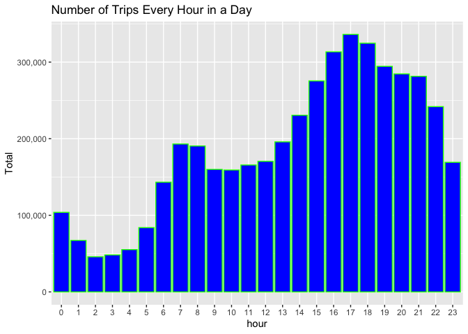
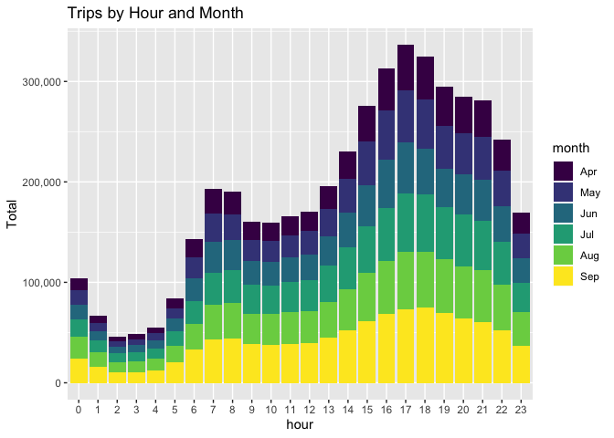

UberDataAnalysis
================

## Introduction: Installing Required Packages

``` r
library(scales) #helps constructing scales for plots
library(ggplot2) #used for data visualization
library(ggthemes) #package that contains extra themes for ggplot2
library(dplyr)
```

    ## 
    ## Attaching package: 'dplyr'

    ## The following objects are masked from 'package:stats':
    ## 
    ##     filter, lag

    ## The following objects are masked from 'package:base':
    ## 
    ##     intersect, setdiff, setequal, union

``` r
library(tidyr) #used for data cleaning
library(DT) #provides R interface for DataTables (Java) library
library(lubridate) #helps parse/manipulate dates
```

    ## 
    ## Attaching package: 'lubridate'

    ## The following object is masked from 'package:base':
    ## 
    ##     date

## Importing Pickup Data (CSVs)

``` r
april <- read.csv("/Users/Gavin/Desktop/UberRideVisualization/Uber-dataset/uber-raw-data-apr14.csv")
may <- read.csv("/Users/Gavin/Desktop/UberRideVisualization/Uber-dataset/uber-raw-data-may14.csv")
june <- read.csv("/Users/Gavin/Desktop/UberRideVisualization/Uber-dataset/uber-raw-data-jun14.csv")
july <- read.csv("/Users/Gavin/Desktop/UberRideVisualization/Uber-dataset/uber-raw-data-jul14.csv")
august <- read.csv("/Users/Gavin/Desktop/UberRideVisualization/Uber-dataset/uber-raw-data-aug14.csv")
september <- read.csv("/Users/Gavin/Desktop/UberRideVisualization/Uber-dataset/uber-raw-data-sep14.csv")
```

## Combining Pickup Data into Dataframe

``` r
#a data frame that stacks all the months into a single data frame
data2014 <- rbind(april,may,june,july,august,september) 

#converting the "date.time" column to a calendar date format
data2014$Date.Time <- as.POSIXct(data2014$Date.Time,format="%m/%d/%Y %H:%M:%S")
data2014$Time <- format(as.POSIXct(data2014$Date.Time,format="%m/%d/%Y %H:%M:%S"),format="%H:%M:%S")
data2014$Date.Time <- ymd_hms(data2014$Date.Time)

#factorizing each column
data2014$day <- factor(day(data2014$Date.Time))
data2014$month <- factor(month(data2014$Date.Time,label=TRUE))
data2014$year <- factor(year(data2014$Date.Time))
data2014$dayofweek <- factor(wday(data2014$Date.Time,label=TRUE))


data2014$hour <- factor(hour(hms(data2014$Time)))
data2014$minute <- factor(minute(hms(data2014$Time)))
data2014$second <- factor(second(hms(data2014$Time)))
```

## Creating a Colors Vector

``` r
colors = c("#CC1011", "#665555", "#05a399", "#cfcaca", "#f5e840", "#0683c9", "#e075b0")
```

## Number of Trips Every Hour in a Day + Every Hour in Each Month

``` r
library(magrittr)
```

    ## 
    ## Attaching package: 'magrittr'

    ## The following object is masked from 'package:tidyr':
    ## 
    ##     extract

``` r
library(dplyr)
library(gridExtra)
```

    ## 
    ## Attaching package: 'gridExtra'

    ## The following object is masked from 'package:dplyr':
    ## 
    ##     combine

``` r
hourdata <- data2014 %>% group_by(hour) %>% dplyr::summarize(Total=n())

plot1 <- ggplot(hourdata,aes(hour,Total)) +
  geom_bar(stat="identity",fill="blue",color="green") +
  ggtitle("Number of Trips Every Hour in a Day") +
  theme(legend.position='none') +
  scale_y_continuous(labels=comma)

plot1
```

<!-- -->

``` r
monthhour <- data2014 %>% group_by(month,hour) %>% dplyr::summarize(Total=n())

plot2 <- ggplot(monthhour,aes(hour,Total,fill=month)) +
  geom_bar(stat="identity") +
  ggtitle("Trips by Hour and Month") +
  scale_y_continuous(labels=comma)

plot2
```

<!-- -->

``` r
#require(gridExtra)
#grid.arrange(plot1,plot2,ncol=2)
```
